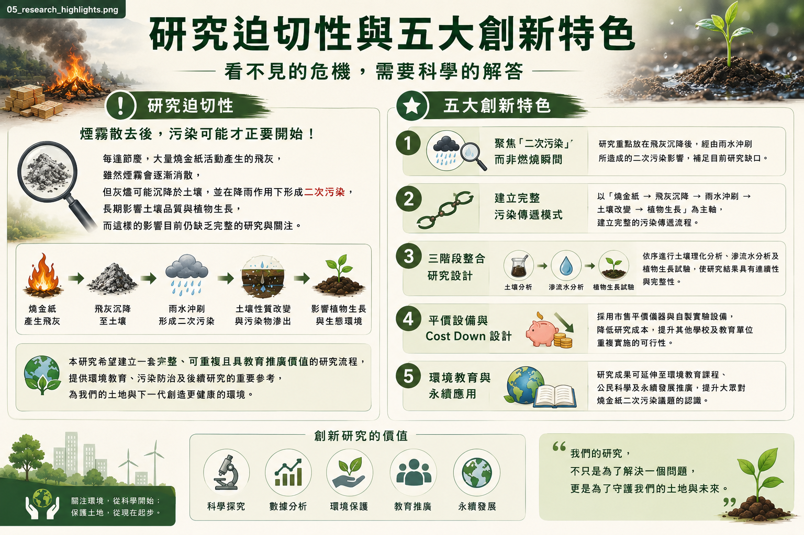
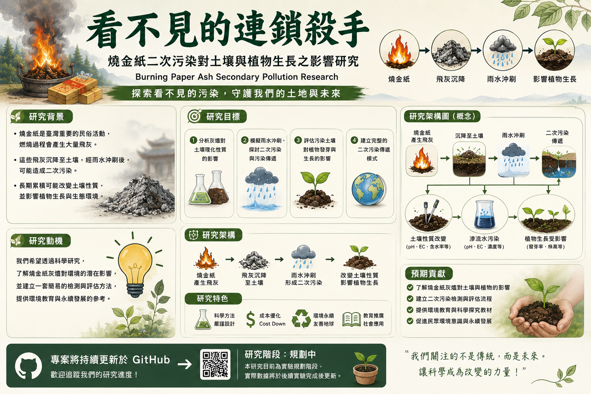
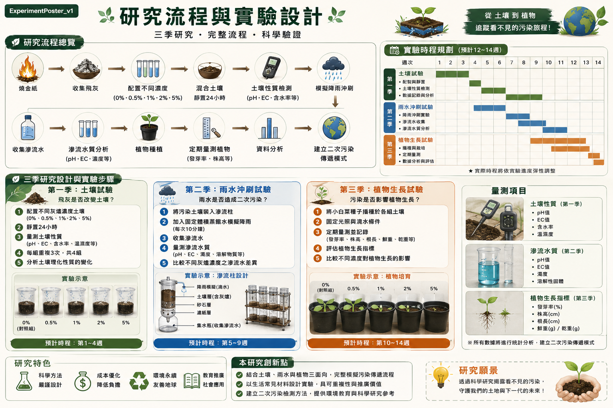
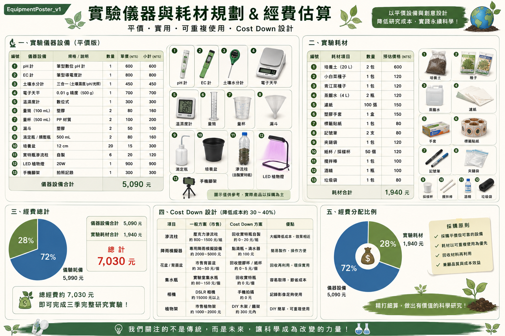
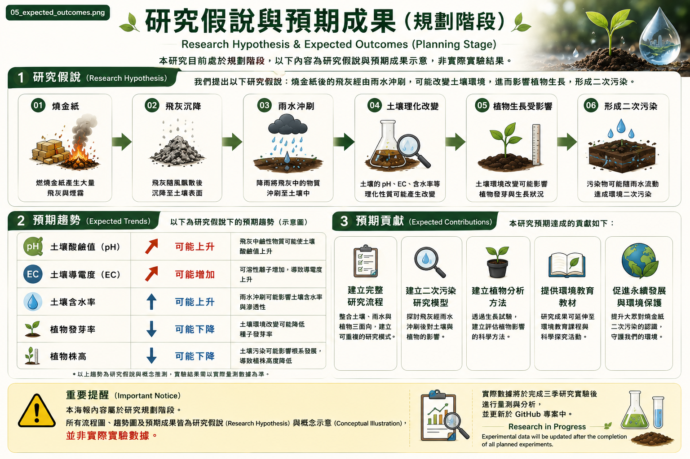
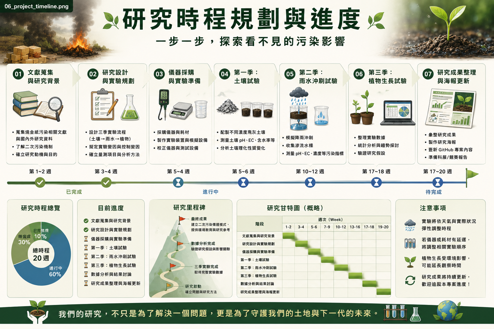
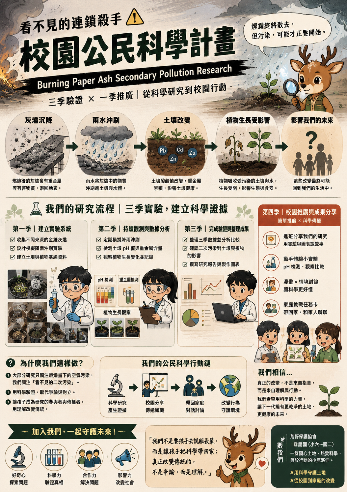
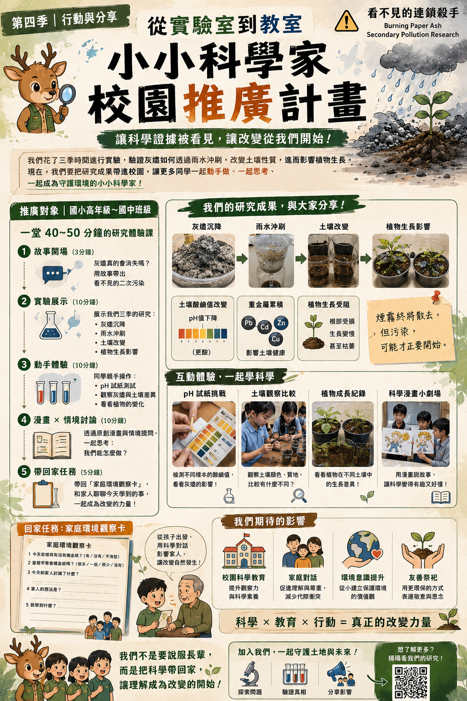

# 🔥 看不見的連鎖殺手

## Invisible Chain Reaction

### 🦌 Grassland Deer × Citizen Science Journey

### 草原鹿 × 校園公民科學行動

---

> **不是因為知道答案。**
>
> **而是因為相信，每一個問題，都值得我們一起尋找答案。**

**One Year · One Question · One Team · One Discovery**

---

# 🌱 我們想解開一個生活中的謎題

如果一粒灰燼，

離開香爐之後，

它會去哪裡？

會留在土壤？

會跟著雨水移動？

會影響植物嗎？

我們不知道。

所以，

想和大家一起找答案。

---

# ❓ 為什麼值得研究？

生活中的每一天，

環境都在默默改變。

如果能了解灰燼在環境中的旅程，

就能更認識：

🌱 土壤

💧 水

🌿 植物

也提醒我們，

一起關心生活環境，

以及與生活息息相關的食物來源。

---

# 🔍 我們想怎麼做？

像小小科學偵探一樣，

一步一步找答案。

👀 觀察

📝 記錄

🧪 比較

📊 整理

🤝 分享

不用猜，

讓證據告訴我們答案。

---

# 🤝 每個人都可以參與

不用很會做實驗。

每個人，

都能找到自己的位置。

有人：

📷 拍照

🌱 照顧植物

📝 做紀錄

📊 整理資料

🎨 畫海報

🎤 分享成果

**每一位夥伴，都是研究的重要力量。**

---

# 🌱 我們一年要完成什麼？

不是只有完成研究。

更希望完成：

✅ 一份研究紀錄

✅ 一套可以分享的方法

✅ 一場公民科學行動

✅ 一個更多人願意加入的故事

---

# 🗺️ 公民科學行動地圖

| 階段 | 一起完成 |
|------|---------|
| 🌱 第一季 | 觀察土壤 |
| 💧 第二季 | 觀察灰燼遇到雨水後的變化 |
| 🌿 第三季 | 觀察植物生長 |
| 📊 最後 | 整理成果、分享發現 |

> **每位草原鹿夥伴，都能依自己的興趣一起參與。**

---

# 🌍 我們想帶來什麼？

希望更多人知道：

科學，

不是只有實驗室。

每個人，

都可以從生活開始，

一起觀察、

一起思考、

一起發現。

---

# 📢 我們想分享給誰？

👧 同學

👨‍👩‍👧 家長

👩‍🏫 老師

🌱 社區

一起分享，

一起學習，

一起守護我們生活的環境。

---

# ❤️ 為什麼值得加入？

因為，

每一個問題，

都值得探索。

每一位孩子，

都可以參與。

每一次觀察，

都可能成為新的發現。

---

## 🦌 草原鹿 × 校園公民科學

### 一起觀察

### 一起思考

### 一起發現

### 一起分享

---

> **Every discovery begins with one simple question.**

> **每一個重要的發現，都始於一個看似簡單的問題。**

